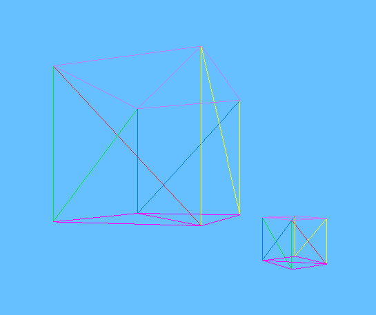

6/6/2026
- A little late in the game to start taking note but getting into real perspective projection / homogeneous coordinates and wanted to start writing down some ideas
- Currently not using homogeneous coordinates (that's next) - just manually projecting each vertex

```C
void renderEntity(Entity_t *entity) {
		std::vector<Vertex_t> projected(entity->shape->vertices.size());
		Vertex_t vertex;
		for (size_t i=0; i<entity->shape->vertices.size(); ++i) {
			vertex = entity->shape->vertices[i];

			// // scale
			// vertex = vertex * entity->scale;
			// // rotate about y-axis
			// rotateY(vertex, entity->angleY);
			// // translation
			// vertex = vertex + entity->position;
			applyTransformations(vertex, entity);

			projected[i].location = projectVertex(vertex);
			projected[i].hue = entity->shape->vertices[i].hue;
		}
		for (size_t i=0; i<entity->shape->triangles.size(); ++i) {
			renderTriangle(entity->shape->triangles[i], projected);
		}
}
```

- `applyTransformation` does everythhing shown in the commented out portion
- `projectVertex` looks like this

```C
 Point_t projectVertex(const Vertex_t& V) {
	/**
	 * Project vertex from scene
	 * onto 2D viewport.
	 * 
	 * P`.x = P.x * (1 / ASPECT_RATIO) * (D / P.z)
	 * P`.y = P.y * (D / P.z)
	 * P`.z = D
	 * 
	 * Then, scale 2D (technically 3D but projected onto viewport) coordinates from 
	 * viewport to canvas by calling
	 * viewportToCanvas().
	 * 
	 * Returns canvas coordinates of vertex.
	 */
	const Point_t& P = V.location;
	return viewportToCanvas(
		(P.x * (1 / ASPECT_RATIO) * (D / P.z)), 
		(P.y * (D / P.z))
	);
 }
 ```

 - The reason I get excited and started taking notes is b/c the ASPECT_RATIO piece
 - I was originally scaling the viewport to have the same aspect ratio as the screen
 - Then I did some research and figured out that's a no-no and this aspect ratio math is actually part of the "real" perspective projection math (I think the math in CGFS is a bit simplified).
 - So scaling by the inverse of the aspect ratio, we get:

 